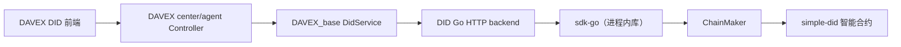

# DID 系统集成设计与变更边界

> 文档状态：架构基线（后续 DID 相关开发前必须先阅读）
> 适用仓库：`DAVEX`
> 功能定位：DID 是独立新功能，不是对现有 DAVEX 交互链路的替换或强制改造。

## 1. 文档目的

本文档用于固化 DAVEX 集成 DID 系统时的架构决策、模块边界和兼容性约束，作为后续设计、编码、审查和验收的共同检查依据。

核心要求是：

1. DID 以新功能的方式加入 DAVEX。
2. 现有 DAVEX 功能仍按原来的 URL、请求和鉴权方式运行。
3. DID 后端不可用时，只允许 DID 新功能失败，不得导致 DAVEX 原有功能不可用。
4. 不因集成 DID 而强制现有业务请求携带 VC/VP，不在现有全局拦截器中默认增加 DID 校验。

## 2. 已确认的总体决策

### 2.1 DID 是新功能，不接管旧功能

集成后的用户可见变化应当为：

- DAVEX 现有导航、页面、URL 和业务流程保持不变。
- 前端导航栏新增一个独立的“DID 系统”入口。
- 用户进入 DID 系统后，才使用 DID 生成、注册、凭证签发、凭证验证、VP、匿名认证和撤销等新能力。
- DID 功能与现有业务的深度绑定属于后续阶段，需要单独设计和确认，不在首次集成中默认开启。

### 2.2 部署角色不等于 DID 业务角色

`center` 和 `agent` 是 DAVEX 的部署与拓扑角色，不是 DID 权限角色。

| 概念 | 示例 | 变化方式 |
|---|---|---|
| DAVEX 部署角色 | `center`、`agent` | 由部署拓扑决定 |
| DID 业务主体 | 法院、检察院、数据提供方、应用 | 由当前 actor 决定 |
| 链上权限角色 | `policy_manager`、`credential_issuer`、`verifier`、holder | 由 DID 和智能合约状态动态决定 |

因此：

- center 可以签发 VC，也可以作为 holder 出示 VP。
- agent 可以验证 VP，也可以在获得链上角色后签发 VC 或管理策略。
- Java 代码不得通过 `nodeType == CENTER` 之类的条件硬编码 DID 权限。
- 最终授权必须由当前 actor 身份、链上角色和智能合约校验共同决定。

## 3. 目标架构

```text
DAVEX/
├── DAVEX_base/
│   └── src/main/java/DavexBase/did/
│       ├── client/                # Java -> Go HTTP Client
│       ├── config/                # did.* 配置模型
│       ├── context/               # DidActorContext
│       ├── dto/                   # 共享请求/响应 DTO
│       ├── service/               # 完整 Java DID 应用服务
│       └── exception/             # 统一异常和错误转换
│
├── DAVEX_center/
│   └── src/main/java/DavexCenter/module/did/
│       ├── controller/            # center 暴露的 DID 路由
│       └── context/               # center actor 解析/选择
│
├── DAVEX_agent/
│   └── src/main/java/DavexAgent/module/did/
│       ├── controller/            # agent 暴露的 DID 路由
│       └── context/               # agent actor 解析/选择
│
├── did/
│   ├── backend/                   # Go HTTP 服务
│   ├── sdk-go/                    # Go SDK 库
│   ├── protocol/                  # Go 协议 DTO/编码
│   └── simple-did/                # ChainMaker 智能合约
│
└── contracts/
    └── did-http.md                 # Java <-> Go 精确 HTTP 契约
```

### 3.1 运行时调用链



`sdk-go` 是 Go 库，不是供 Java 直接访问的网络进程。运行时启动的是嵌入 `sdk-go` 的 Go HTTP backend，不得由 Java 启动或控制 `did-terminal` 子进程。

## 4. 各模块职责边界

### 4.1 `DAVEX_base`：共享 Java DID 应用层

`DAVEX_base` 可以实现完整、可复用的 Java 侧 DID 能力，center 和 agent 通过注入同一个 `DidService` 使用。

应当包含：

- `DidBackendClient`：封装 Java 到 Go backend 的 HTTP 调用。
- `DidService`：提供 DID、Policy、VC、VP、匿名认证和撤销等全部 Java 用例入口。
- `DidActorContext`：表达本次请求的 actor，不使用 center/agent 类型替代 actor 身份。
- DID 专用 DTO、统一返回、异常转换、超时和 trace ID。
- 将 Go backend 返回结果转换为 DAVEX 统一响应的逻辑。

不得包含：

- Spring MVC Controller。
- DID 私钥或 ChainMaker 私钥。
- ChainMaker Go/Java SDK 实现。
- 环签名、ECDSA、Merkle 证明等密码学实现。
- 通过 center/agent 类型硬编码的权限判断。
- 对现有 DAVEX 全局请求的强制 DID 拦截。

### 4.2 `DAVEX_center`：薄接入层

center 只保留节点特有的内容：

- DID 新功能 Controller。
- 当前 center 请求如何解析为 `DidActorContext`。
- 与 center 特有业务流程的组装。
- 如确有必要，center 特有的展示数据和持久化适配。

center 不限于“管理者”或“签发者”。当 center 需要作为 holder 生成 VP 时，其 Controller 可直接调用 base 中已有的公共服务，不复制业务实现。

### 4.3 `DAVEX_agent`：薄接入层

agent 只保留节点特有的内容：

- DID 新功能 Controller。
- 当前 agent 请求如何解析为 `DidActorContext`。
- 与 agent 本地数据或任务相关的组装。
- 未来明确启用时的 DID 认证拦截器或业务校验点。

agent 不限于“验证者”。当 agent 获得链上签发或策略管理权限后，可以通过自身 Controller 调用 base 的相同能力。

### 4.4 `did/backend`：DID 领域服务

Go backend 是 DID 领域能力的唯一业务实现入口，包括：

- actor 身份与 ChainMaker SDK client 管理。
- DID 生成、注册、更新和停用。
- 策略、VC、VP 和权限证明。
- DID-LSAG 匿名认证。
- 凭证撤销与委员会流程。
- 本地私密状态的安全保存。
- HTTP 身份验证、请求审计和错误返回。

Java 不重写上述领域逻辑，避免 Java、Go SDK 和智能合约之间出现三套实现。

### 4.5 `did/simple-did`：链上最终裁决

智能合约负责：

- DID 和链上 Origin 的绑定。
- 链上角色与治理权限。
- 策略锚、VCProof、匿名群组和密钥映像。
- 认证防重放与撤销状态。
- 链上操作的最终授权和一致性检查。

Java Controller 是否暴露某个按钮或路由，不代表 actor 必然拥有对应权限。所有敏感操作必须继续由 Go backend 和智能合约校验。

## 5. 前端集成边界

### 5.1 产品形态

首次集成只做以下增量变更：

- 在现有 DAVEX 导航栏中新增“DID 系统”入口。
- 使用独立的 DID 路由空间、API 文件和页面目录。
- DID 页面可以覆盖全部流程，但根据当前 actor 的角色和能力控制操作是否可用。
- 现有页面不强制跳转 DID 页面，不强制先获取凭证才能使用。

### 5.2 前端隔离要求

- DID API 应放在独立文件中，不将 DID 调用混入旧业务 API 文件。
- DID 页面状态不得污染现有全局用户、目录、文件和任务状态。
- DID backend 不可用时，应在 DID 页面内显示错误，不得导致整个前端白屏或全局登录失效。
- 前端不保存 DID 私钥、ChainMaker 私钥或 Go backend 管理员凭据。

## 6. 兼容性不变式

后续任何 DID 实现都必须满足以下约束。如需打破其中任何一条，必须将其作为独立需求提出、评估影响并获得明确确认。

### 6.1 后端不变式

- [ ] 不修改现有业务 Controller 的 URL、HTTP method、请求字段和响应字段。
- [ ] 不给现有 Controller 默认增加 VC/VP/DID 必填参数。
- [ ] 不在现有全局 `SecurityConfig`、`WebConfig` 或拦截器中强制开启 DID 校验。
- [ ] 不替换现有 JWT、ABAC 或 center-agent URL 直接交互机制。
- [ ] Go DID backend 未启动或链不可用时，center/agent 仍能启动并执行原有功能。
- [ ] DID 专用 client 使用有界超时，调用失败转换为 DID 专用错误，不影响其他业务请求。
- [ ] DID 配置使用独立 `did.*` 命名空间，密钥和 token 不硬编码进仓库。
- [ ] DID 新表使用独立表名；默认不修改现有表字段和数据含义。

### 6.2 前端不变式

- [ ] 只在导航栏增加 DID 入口，不重构旧导航和旧页面。
- [ ] DID 使用独立路由和独立 API 模块。
- [ ] 现有页面不依赖 DID 初始化请求。
- [ ] DID 页面加载或调用失败不得影响旧页面。
- [ ] 不改变现有 `request` 全局拦截器的行为，除非变更与 DID 无关且另有明确需求。

### 6.3 代码边界不变式

- [ ] DID 业务变更优先限定在 `did/`、`DAVEX_base/.../did/`、`DAVEX_center/.../module/did/`、`DAVEX_agent/.../module/did/`、DID 前端目录和 `contracts/did-http.md`。
- [ ] 修改 DID 以外模块前，必须先说明为什么无法通过 DID 模块边界完成。
- [ ] 不借 DID 集成顺带重构旧代码、升级无关依赖、格式化全仓库或修复无关问题。
- [ ] 新增/修改 DID 接口时，先更新 `contracts/did-http.md`，再实现 Go 和 Java。

## 7. API 与配置隔离

### 7.1 API 命名空间

- Java 对前端的 DID 新接口应使用独立前缀，建议为 `/api/v1/did/**`。
- Java 到 Go backend 的精确路径由 `contracts/did-http.md` 定义。
- 现有 `/api/v1/control/**` 属于旧的 `goBackend/goSdk` 集成实验，不作为新 DID 架构的默认命名。
- DAVEX 对前端返回体继续遵守项目统一格式：`code` / `message` / `data`。
- Go backend 原始响应与 DAVEX 统一响应不一致时，由 base 中的 client/service 进行适配，不将 Go 内部格式泄漏到旧 DAVEX 页面。

### 7.2 配置命名空间

建议 Java 使用以下独立配置，精确字段在实现时固化：

```yaml
did:
  enabled: false
  backend-url: http://localhost:8081
  connect-timeout-ms: 2000
  request-timeout-ms: 5000
  token: ${DID_BACKEND_TOKEN:}
```

约束：

- 未配置 DID backend 时，不得影响 Java 服务启动。
- `did.enabled=false` 时，DID 功能可返回“未启用”，但其他功能必须正常。
- 演示或上线环境可显式开启 DID 功能。
- Go backend 建议使用 `8081`，避免与 DAVEX agent 默认 `8080` 冲突。

## 8. actor 与凭据边界

### 8.1 `DidActorContext`

`DidActorContext` 应当至少能表达：

- 当前 actor alias。
- 当前 DID（已绑定时）。
- 请求 trace/request ID。
- 必要的调用授权信息或其引用。

实现时禁止将“当前 actor”放入可被并发请求共享修改的单例字段。应通过方法参数或安全的 request-scoped context 传递。

### 8.2 私钥与 token

- DID 协议私钥和 ChainMaker 私钥只由 Go backend 及其本地状态持有。
- Java 与前端不接收、不记录、不持久化上述私钥。
- Go backend token 通过环境变量或本地安全配置注入，不写入仓库。
- 不允许普通前端请求未经 Java 授权就任意透传 `X-Actor-Alias`。

## 9. 部署演进

### 9.1 第一阶段：单个 DID backend 打通新功能

```text
DAVEX DID 前端
    -> DAVEX_center
    -> DID Go backend(:8081)
    -> ChainMaker
```

本阶段只验证 DID 新导航和 DID 功能闭环，不把 DID 校验接入原有文件、目录、查询、MPC、TEE 等业务。

### 9.2 第二阶段：按节点部署

当需要真正验证 center-agent 通信主体时，可在每个节点部署相同的 Go backend 程序，但使用各自的：

- ChainMaker SDK 配置和证书。
- DID actor 和协议私钥。
- backend token。
- 本地状态文件。

该阶段仍需将每个现有业务的 DID 校验视为单独需求，逐个接入，不得一次性修改全局拦截器。

## 10. 旧 `goBackend/goSdk` 迁移规则

当前仓库中已存在旧的：

- `goBackend/`
- `DAVEX_center/src/main/java/DavexCenter/goSdk/`
- `DAVEX_ui/src/api/goSdk.js`
- `DAVEX_ui/src/views/auth/` 中的部分 DID/VC/VP 页面
- `contracts/goBackend.http.md`
- `contracts/javaBackend.http.md`

它们属于早期 Java -> Go -> ChainMaker 联调实验，与新 `did-contract-master` 的 API、actor 模型、响应码、凭证和撤销机制不完全兼容。

迁移必须遵守：

1. 先完成新 `contracts/did-http.md`。
2. 新增或迁入 `did/` 子系统。
3. 在 `DAVEX_base` 建立新的 DID client/service/DTO。
4. 新增 center 的 DID Controller 和新前端导航。
5. 完成新 DID 链路的独立验收。
6. 确认前端、Java、SQL、配置和文档不再引用旧实现。
7. 另行确认删除范围后，才删除旧 `goBackend/goSdk` 代码。

在新链路完成前，不直接删除旧实现，也不在新旧两套实现之间做隐式自动切换。

## 11. 变更路径白名单

后续 DID 开发应优先将变更限定在：

```text
contracts/did-http.md
did/**
DAVEX_base/src/main/java/DavexBase/did/**
DAVEX_center/src/main/java/DavexCenter/module/did/**
DAVEX_agent/src/main/java/DavexAgent/module/did/**
DAVEX_ui/src/api/did.*
DAVEX_ui/src/views/did/**
DAVEX_ui/src/router/**                  # 仅增加 DID 路由
DAVEX_ui/src/layout/**                  # 仅增加 DID 导航入口
DAVEX_ui_agent/src/api/did.*            # 启用 agent DID UI 时
DAVEX_ui_agent/src/views/did/**         # 启用 agent DID UI 时
DAVEX_center/src/main/resources/**      # 仅 did.* 配置
DAVEX_agent/src/main/resources/**       # 仅 did.* 配置
SQL/**                                  # 仅独立 DID 新表
```

如需修改上述范围外的文件，执行前必须说明：

1. 修改的文件。
2. 与 DID 的必要关系。
3. 对旧功能的影响。
4. 回滚方式。
5. 将如何验证旧功能没有被破坏。

## 12. 实施顺序

新增或扩展 DID 功能时，遵守以下顺序：

1. 阅读本文档，明确本次变更是否属于 DID 模块。
2. 执行 Git/环境预检，记录已有用户改动。
3. 先更新 `contracts/did-http.md`的 path、method、request、response 和错误码。
4. 先实现并手动验证 Go backend 接口。
5. 在 `DAVEX_base` 实现或扩展共享 Java DID 能力。
6. 在 center/agent 增加薄 Controller 或节点特有组装。
7. 在独立 DID 前端目录增加页面，最后只向导航/路由增加入口。
8. 验证 DID 开启时的新功能。
9. 停止 Go DID backend 或关闭 DID 配置，验证 DAVEX 原有功能仍可用。
10. 检查 Git 变更范围，确认没有无关文件被修改。

## 13. 验收清单

### 13.1 旧功能回归基线

- [ ] 不启动 Go DID backend，center 可正常启动。
- [ ] 不启动 Go DID backend，agent 可正常启动。
- [ ] 现有登录和 JWT 流程行为不变。
- [ ] 现有 center-agent URL 交互不需要 DID 凭证。
- [ ] 现有目录、文件、查询、计算任务等主要页面仍可访问。
- [ ] DID 页面请求失败不影响其他前端路由。

### 13.2 DID 新功能基线

- [ ] 导航栏出现独立“DID 系统”入口。
- [ ] DID 页面可以查看当前 actor 和链上角色。
- [ ] 可以完成 DID 生成、注册和查询的最小闭环。
- [ ] 可以完成至少一条 VC 签发与验证流程。
- [ ] 可以完成至少一条 VP 生成与验证流程。
- [ ] 无链上权限的 actor 即使能看到界面，相关操作也会被 Go backend/智能合约拒绝。
- [ ] Java/Go 错误能被定位，不记录或返回私钥。

## 14. 明确不在首次集成中做的事

- 不使用 DID 替换现有 JWT 登录。
- 不使用 DID 替换现有 ABAC 规则。
- 不要求现有 center-agent 业务请求必须携带 VP。
- 不改造现有文件传输、目录同步、查询、MPC、TEE 和 verdict 流程。
- 不因 DID 而引入消息队列、注册中心、网关等复杂基础设施。
- 不重写 `did-contract-master` 已有的 Go 密码学和链上逻辑。
- 不在新 DID 链路验收前删除旧 `goBackend/goSdk` 实验代码。

## 15. 后续任务开始前的快速核对

每次 DID 相关开发前，至少回答以下问题：

1. 这次变更是新增 DID 能力，还是在改变旧 DAVEX 行为？
2. 能否把修改限制在 DID 路径白名单内？
3. 是否已先更新 `contracts/did-http.md`？
4. 是否把 center/agent 错误当成 DID 业务角色？
5. 是否仍由 Go backend 和智能合约做最终校验？
6. Go DID backend 停止时，旧 DAVEX 功能是否仍可用？
7. 是否修改了与 DID 无关的文件？如果是，是否有明确必要性？

## 16. 一句话原则

> DID 系统是 DAVEX 中一个可独立开启、可独立失败、可按 actor 动态授权的新功能；在用户明确要求之前，它不接管、不拦截、不改变 DAVEX 原有业务链路。
